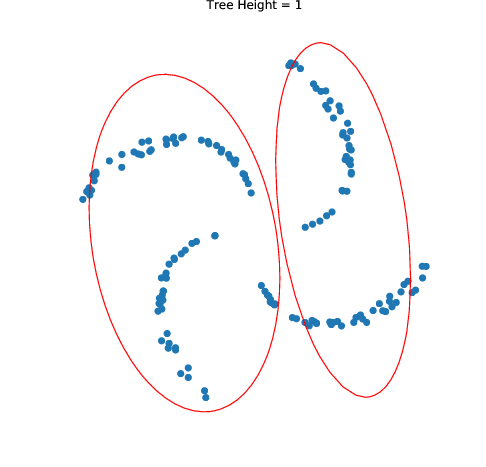
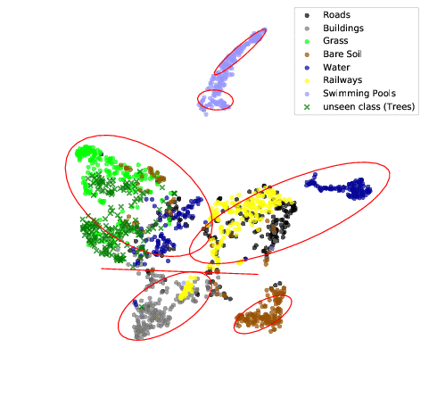
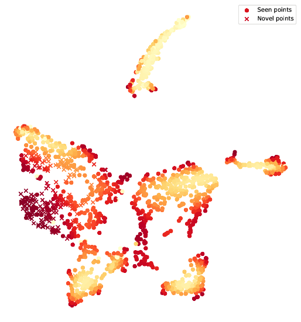

# Density Forest 
Code Repository of the EPFL SIE Master Project, Spring Semester 2018.

The goal of this project is to perform error detection and novelty detection in Convolutional Neural Networks (CNNs) using Density Forests. Applications to the MNIST dataset and a dataset for semantic segmentation of land cover classes in Zurich are visualized in  `Code/` and `Zurich/`.


## 📈 Visualization
Density trees maximize Gaussianity at each split level. In 2D this might look as follows:

 

A density forest is a collection of density trees each trained on a random subset of all data.

 

The above example shows the t-SNE of the pre-softmax activations of a network trained for semantic segmentation of the
 Zurich dataset, leaving out one class during training. 
Density trees were trained on bootstrap samples of all classes but the unseen one. 

Confidence of each data point in the test set, the probability is calculated as the average Gaussian likelihood to come from the leaf node clusters.



Darker points represent regions of lower certainty and crosses represent activations of unseen classes.
 
 

## 📖 Usage of the `DensityForest` class:
#### Fitting a Density Forest
Suppose you have your training data `X_train` and test data `X_test`, in `[N, D]` with `N` data points in `D` dimensions:

```python
from density_forest.density_forest import DensityForest

clf_df = DensityForest(**params)  # create new class instance, put hyperparameters here
clf_df.fit(X_train)               # fit to a training set
conf = clf_df.predict(X_test)     # get confidence values for test set
```
Hyperparameters are documented in the docstring. To find the optimal hyperparameters, consider the section below.

#### Finding Hyperparameters
To find the optimal hyperparameters, use the `ParameterSearch` from `helpers.cross_validator`, which allows CV, and hyperparameter search.

```python
from helpers.cross_validator import ParameterSearch

# define hyperparameters to test
tuned_params = [{'max_depth':[2, 3, 4], 'n_trees': [10, 20]}] # optionally add non-default arguments as single-element arrays
default_params = [{'verbose':0, ...}]  # other default parameters 
# do parameter search
ps = ParameterSearch(DensityForest, tuned_parameters, X_train, X_train_all, y_true_tr, f_scorer, n_iter=2, verbosity=0, n_jobs=1, default_params=default_params)
ps.fit()

# get model with the best parameters, as above
clf_df = DensityForest(**ps.best_params, **default_params)  # create new class instance with best hyperparameters
...  # continue as above
```
Check the docstrings for more detailed documentation af the `ParameterSearch` class.


## 🗂 File Structure

### Code
#### `Code/density_forest/`
Package for implementation of Decision Trees, Random Forests, Density Trees and Density Forests
- `create_data.py`: functions for generating labelled and unlabelled data
- `decision_tree.py`: data structure for decision tree nodes
- `decision_tree_create.py`: functions for generating decision trees
- `decision_tree_traverse.py`: functions for traversing a decision tree to predict labels
- `density_tree.py`: data struture for density tree nodes
- `density_tree_create.py`: functions for generating density trees
- `density_tree_traverse.py`: functions for descending density trees and retreiving their Gaussian parameters
- `density_forest.py`: functions for creating density forests
- `helper.py`: various helper functions
- `plots.py`: functions for plotting the data
- `random_forests`: functions for creating random forests

#### `Zurich Land Cover/helpers`: 
General helpers library for semantic segmentation
- `data_augment.py`: custom data augmentation methods applied to both the image and the ground truth
- `helpers.py`: functions for importing, cropping, padding images and other related image tranformations
- `plots.py`: plotter functions for 2D and 3D plots 


#### `Zurich Land Cover/keras_helpers`
Helper functions for Keras
- `helpers.py`: get activations
- `callbacks.py`: callbacks to be evaluated after each epoch
- `unet.py`: UNET model for training of network on Zurich dataset
- `MLP.py`: MLP for Image Transformation Baseline

### Visualizations
#### `Code/`: 
Visualizations of basic functionalities
- `decision_tree.ipynb`: Decision Trees and Random Forest on randomly generated labelled data
- `density_tree.ipynb`: Density Trees on randomly generated unlabelled data
- `MNIST Novelty Detection.ipynb`: Training of a CNN on the MNIST dataset leaving out one class, retrieval of the FC layer activations, comparison of novelty detection methods

#### `Zurich/`
- `Zurich Dataset Data Loading.ipynb`: CNN and data loading illustration for semantic segmentation on the 
"Zurich Summer v1.0" dataset (cf. `Zurich_dataset/README`)
- `Zurich Dataset Novelty Detection.ipynb`: Training of CNN, baselines and DF for novelty detection
- `Zurich Dataset Error Detection.ipynb`: Training of CNN, baselines and DF for error detection

## 🎓 Supervisors:
- Prof. Devis Tuia, University of Wageningen
- Diego Marcos González, University of Wageningen
- Prof. François Golay, EPFL

Cyril Wendl, 2018
